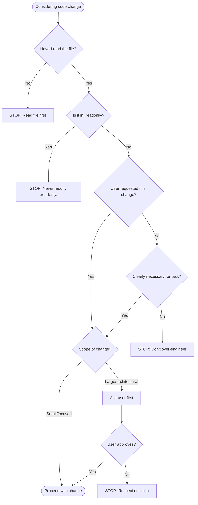
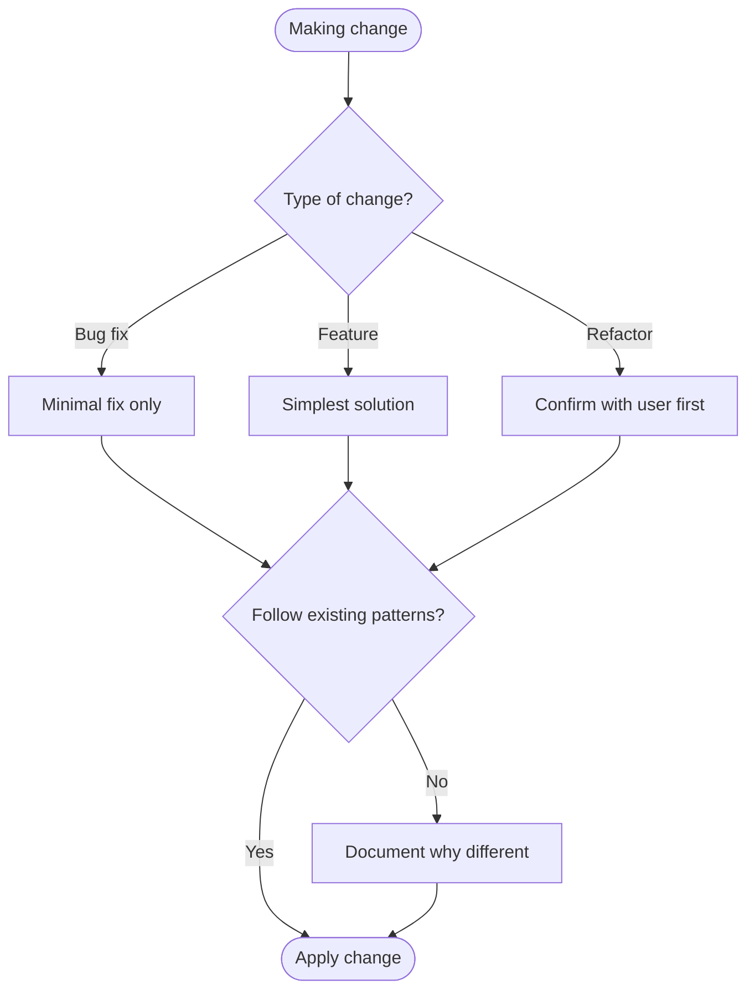
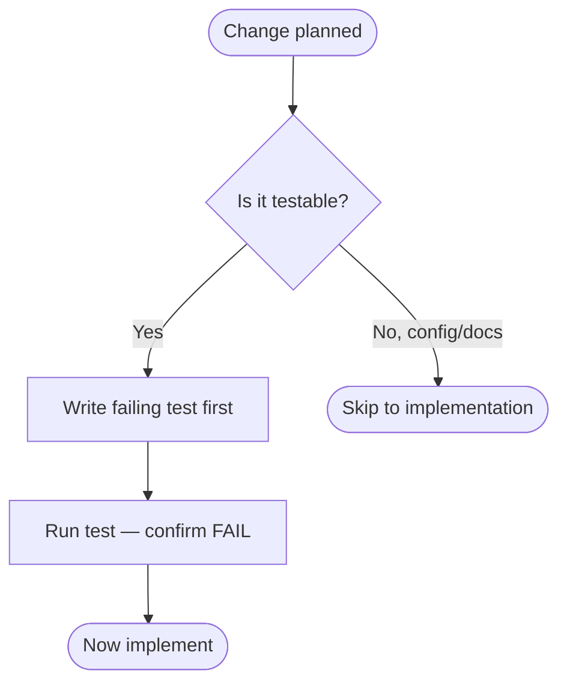
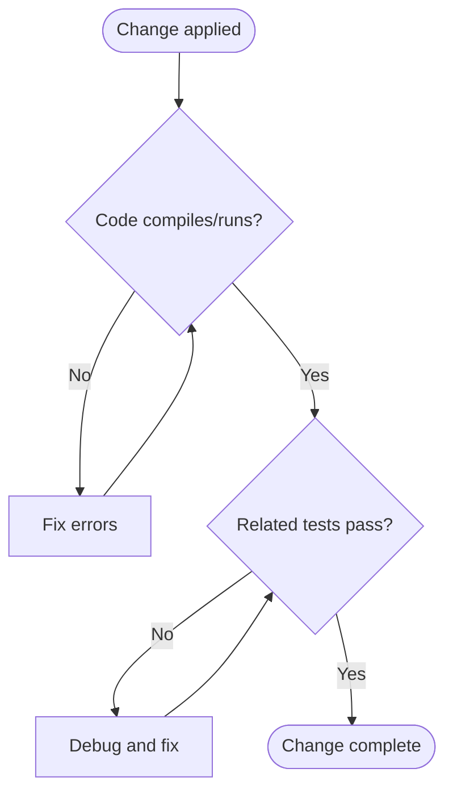

# Code Change Decision Flow

## Should I Modify This Code?

```mermaid
flowchart TD
    START([Considering code change]) --> READ{Have I read the file?}
    READ -->|No| STOP1[STOP: Read file first]
    READ -->|Yes| READONLY{Is it in .readonly/?}
    READONLY -->|Yes| STOP2[STOP: Never modify .readonly/]
    READONLY -->|No| REQUESTED{User requested this change?}
    REQUESTED -->|Yes| SCOPE
    REQUESTED -->|No| NECESSARY{Clearly necessary for task?}
    NECESSARY -->|No| STOP3[STOP: Don't over-engineer]
    NECESSARY -->|Yes| SCOPE
    SCOPE{Scope of change?} -->|Small/focused| PROCEED
    SCOPE -->|Large/architectural| ASK[Ask user first]
    ASK --> APPROVED{User approves?}
    APPROVED -->|Yes| PROCEED
    APPROVED -->|No| STOP4[STOP: Respect decision]
    PROCEED([Proceed with change])
```

## What Kind of Change?

```mermaid
flowchart TD
    CHANGE([Making change]) --> TYPE{Type of change?}
    TYPE -->|Bug fix| MINIMAL[Minimal fix only]
    TYPE -->|Feature| SIMPLE[Simplest solution]
    TYPE -->|Refactor| CONFIRM[Confirm with user first]
    MINIMAL --> PATTERN
    SIMPLE --> PATTERN
    CONFIRM --> PATTERN
    PATTERN{Follow existing patterns?}
    PATTERN -->|Yes| APPLY([Apply change])
    PATTERN -->|No| JUSTIFY[Document why different]
    JUSTIFY --> APPLY
```

## Before Implementation (TDD)

```mermaid
flowchart TD
    PLAN([Change planned]) --> TESTABLE{Is it testable?}
    TESTABLE -->|Yes| WRITE_TEST[Write failing test first]
    TESTABLE -->|No, config/docs| SKIP([Skip to implementation])
    WRITE_TEST --> CONFIRM_RED[Run test — confirm FAIL]
    CONFIRM_RED --> IMPLEMENT([Now implement])
```

## After Change

```mermaid
flowchart TD
    APPLY([Change applied]) --> COMPILE{Code compiles/runs?}
    COMPILE -->|No| FIX[Fix errors]
    FIX --> COMPILE
    COMPILE -->|Yes| TEST{Related tests pass?}
    TEST -->|No| DEBUG[Debug and fix]
    DEBUG --> TEST
    TEST -->|Yes| DONE([Change complete])
```
