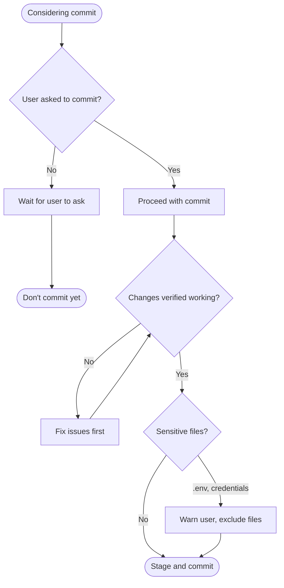
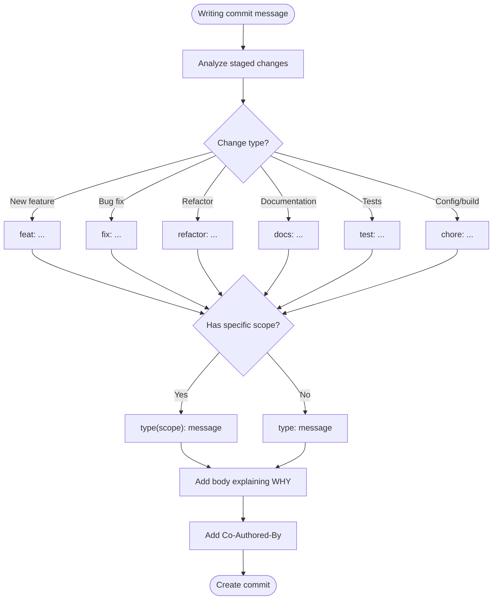
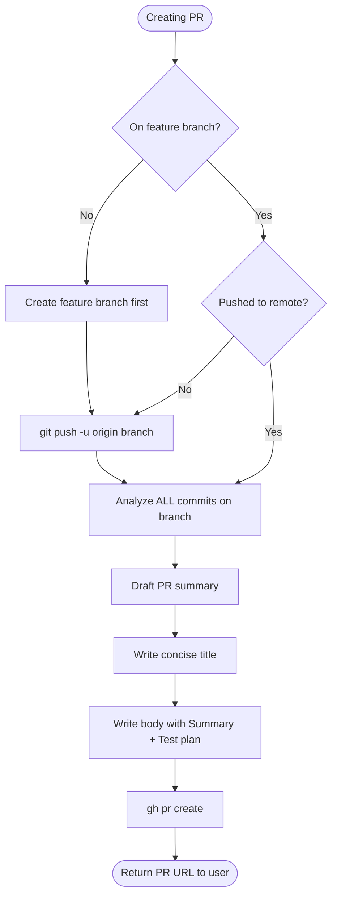

# Commit Decision Flow

## When to Commit

```mermaid
flowchart TD
    START([Considering commit]) --> ASKED{User asked to commit?}
    ASKED -->|Yes| PROCEED
    ASKED -->|No| WAIT[Wait for user to ask]
    WAIT --> DONE([Don't commit yet])

    PROCEED[Proceed with commit] --> VERIFY{Changes verified working?}
    VERIFY -->|No| FIX[Fix issues first]
    FIX --> VERIFY
    VERIFY -->|Yes| SENSITIVE{Sensitive files?}
    SENSITIVE -->|.env, credentials| WARN[Warn user, exclude files]
    SENSITIVE -->|No| STAGE
    WARN --> STAGE
    STAGE([Stage and commit])
```

## Commit Message Flow

```mermaid
flowchart TD
    START([Writing commit message]) --> ANALYZE[Analyze staged changes]
    ANALYZE --> TYPE{Change type?}
    TYPE -->|New feature| FEAT[feat: ...]
    TYPE -->|Bug fix| FIX[fix: ...]
    TYPE -->|Refactor| REFACTOR[refactor: ...]
    TYPE -->|Documentation| DOCS[docs: ...]
    TYPE -->|Tests| TEST[test: ...]
    TYPE -->|Config/build| CHORE[chore: ...]

    FEAT --> SCOPE
    FIX --> SCOPE
    REFACTOR --> SCOPE
    DOCS --> SCOPE
    TEST --> SCOPE
    CHORE --> SCOPE

    SCOPE{Has specific scope?} -->|Yes| ADDSCOPE["type(scope): message"]
    SCOPE -->|No| NOSCOPE["type: message"]

    ADDSCOPE --> BODY
    NOSCOPE --> BODY
    BODY[Add body explaining WHY] --> COAUTHOR["Add Co-Authored-By"]
    COAUTHOR --> COMMIT([Create commit])
```

## PR Flow

```mermaid
flowchart TD
    START([Creating PR]) --> BRANCH{On feature branch?}
    BRANCH -->|No| CREATE[Create feature branch first]
    BRANCH -->|Yes| PUSHED{Pushed to remote?}
    CREATE --> PUSH
    PUSHED -->|No| PUSH[git push -u origin branch]
    PUSHED -->|Yes| ANALYZE
    PUSH --> ANALYZE

    ANALYZE[Analyze ALL commits on branch] --> DRAFT[Draft PR summary]
    DRAFT --> TITLE[Write concise title]
    TITLE --> BODY[Write body with Summary + Test plan]
    BODY --> CREATEPR[gh pr create]
    CREATEPR --> URL([Return PR URL to user])
```
