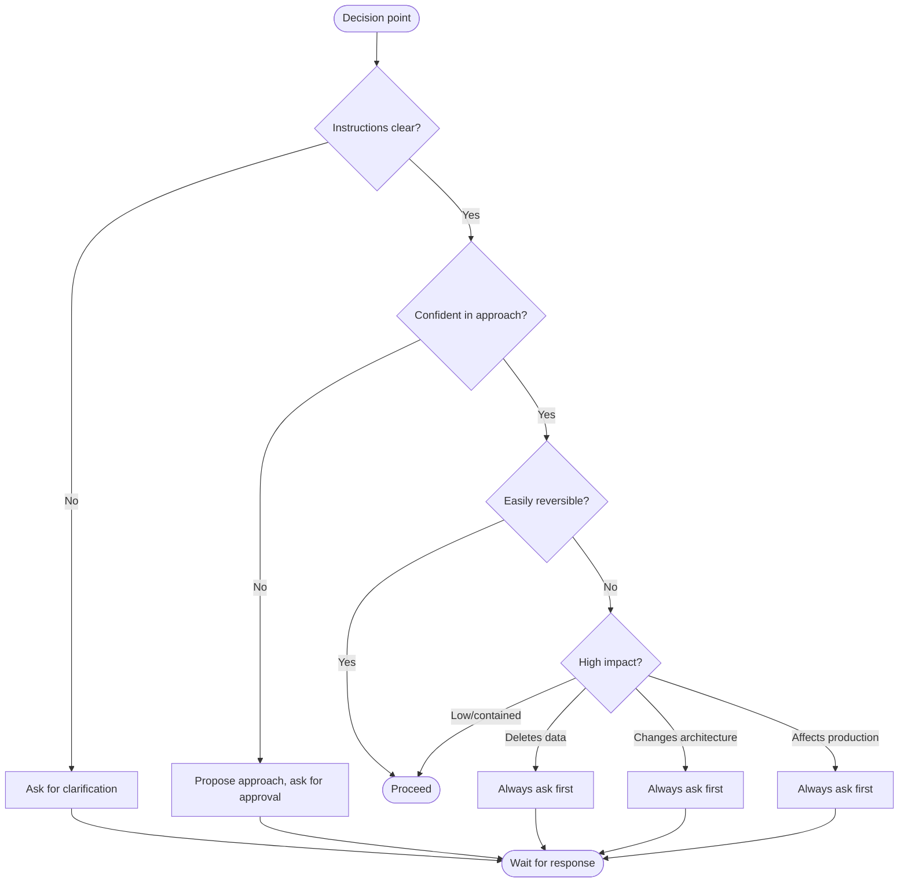
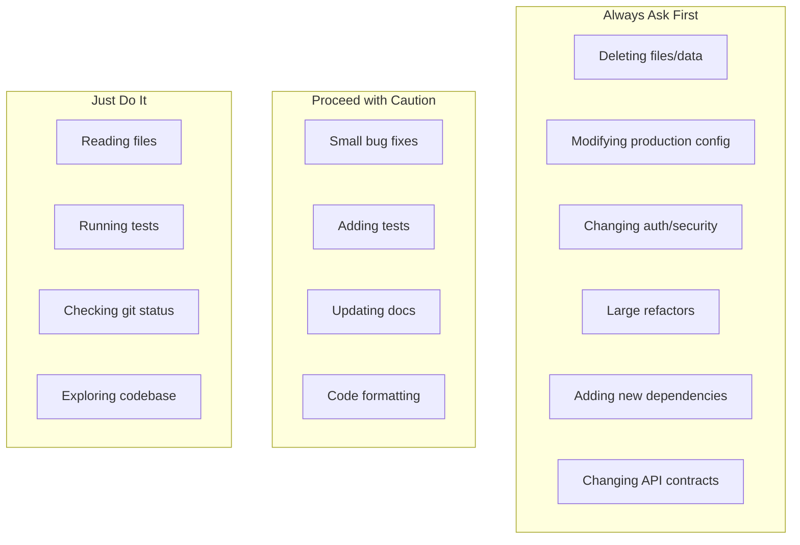
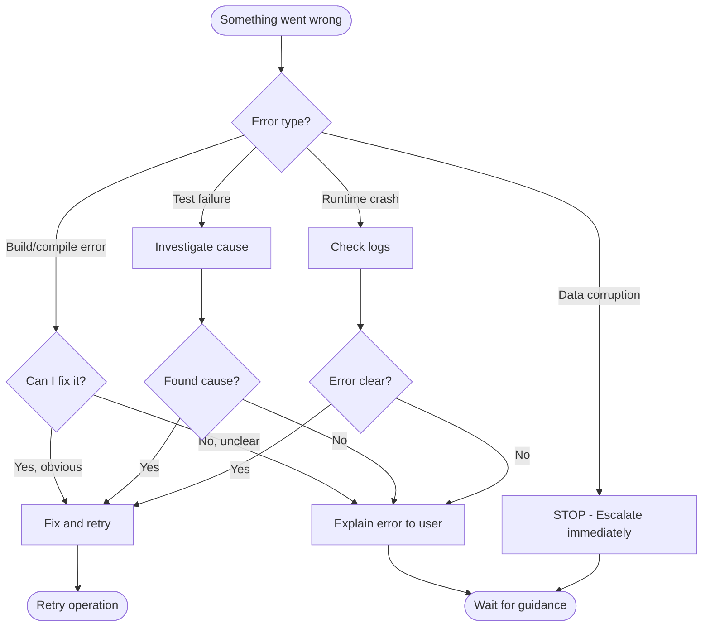

# Escalation Decision Flow

## Should I Ask or Proceed?

```mermaid
flowchart TD
    START([Decision point]) --> CLEAR{Instructions clear?}
    CLEAR -->|Yes| CONFIDENT{Confident in approach?}
    CLEAR -->|No| ASK1[Ask for clarification]

    CONFIDENT -->|Yes| REVERSIBLE{Easily reversible?}
    CONFIDENT -->|No| ASK2[Propose approach, ask for approval]

    REVERSIBLE -->|Yes| PROCEED([Proceed])
    REVERSIBLE -->|No| IMPACT{High impact?}

    IMPACT -->|Deletes data| ASK3[Always ask first]
    IMPACT -->|Changes architecture| ASK4[Always ask first]
    IMPACT -->|Affects production| ASK5[Always ask first]
    IMPACT -->|Low/contained| PROCEED

    ASK1 --> WAIT([Wait for response])
    ASK2 --> WAIT
    ASK3 --> WAIT
    ASK4 --> WAIT
    ASK5 --> WAIT
```

## What to Escalate

```mermaid
flowchart TD
    subgraph ALWAYS_ASK [Always Ask First]
        A1[Deleting files/data]
        A2[Modifying production config]
        A3[Changing auth/security]
        A4[Large refactors]
        A5[Adding new dependencies]
        A6[Changing API contracts]
    end

    subgraph PROCEED_CAREFULLY [Proceed with Caution]
        B1[Small bug fixes]
        B2[Adding tests]
        B3[Updating docs]
        B4[Code formatting]
    end

    subgraph JUST_DO_IT [Just Do It]
        C1[Reading files]
        C2[Running tests]
        C3[Checking git status]
        C4[Exploring codebase]
    end
```

## Error Recovery

```mermaid
flowchart TD
    START([Something went wrong]) --> TYPE{Error type?}

    TYPE -->|Build/compile error| FIXABLE{Can I fix it?}
    TYPE -->|Test failure| INVESTIGATE[Investigate cause]
    TYPE -->|Runtime crash| LOGS[Check logs]
    TYPE -->|Data corruption| STOP[STOP - Escalate immediately]

    FIXABLE -->|Yes, obvious| FIX[Fix and retry]
    FIXABLE -->|No, unclear| EXPLAIN[Explain error to user]

    INVESTIGATE --> CAUSE{Found cause?}
    CAUSE -->|Yes| FIX
    CAUSE -->|No| EXPLAIN

    LOGS --> CLEAR{Error clear?}
    CLEAR -->|Yes| FIX
    CLEAR -->|No| EXPLAIN

    FIX --> RETRY([Retry operation])
    EXPLAIN --> WAIT([Wait for guidance])
    STOP --> WAIT
```
