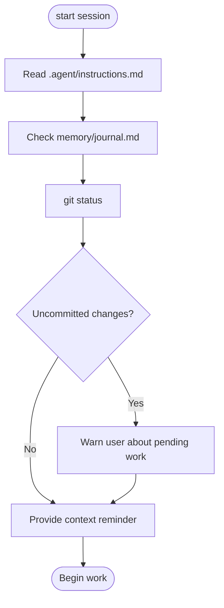
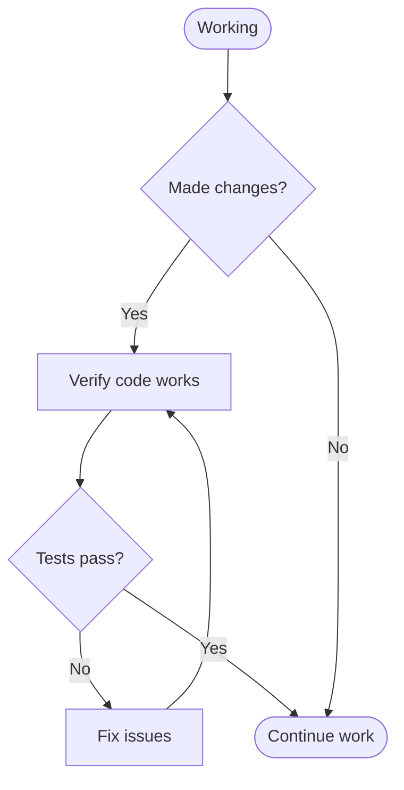
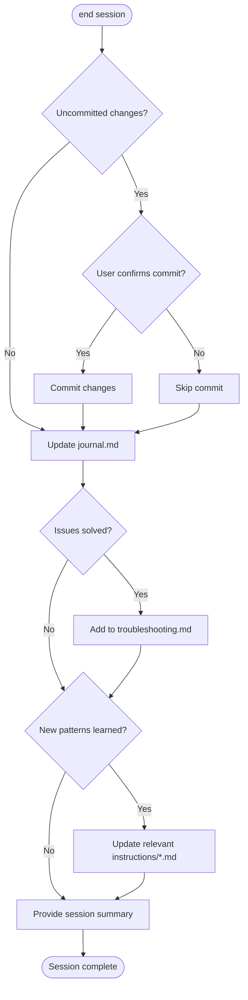

# Session Lifecycle Flow

## Start Session

```mermaid
flowchart TD
    START([start session]) --> READ[Read .agent/instructions.md]
    READ --> JOURNAL[Check memory/journal.md]
    JOURNAL --> GIT[git status]
    GIT --> UNCOMMITTED{Uncommitted changes?}
    UNCOMMITTED -->|Yes| WARN[Warn user about pending work]
    UNCOMMITTED -->|No| READY
    WARN --> READY[Provide context reminder]
    READY --> WORK([Begin work])
```

## During Session

```mermaid
flowchart TD
    WORK([Working]) --> CHANGE{Made changes?}
    CHANGE -->|Yes| VERIFY[Verify code works]
    VERIFY --> TEST{Tests pass?}
    TEST -->|No| FIX[Fix issues]
    FIX --> VERIFY
    TEST -->|Yes| CONTINUE
    CHANGE -->|No| CONTINUE([Continue work])
```

## End Session

```mermaid
flowchart TD
    END([end session]) --> CHANGES{Uncommitted changes?}
    CHANGES -->|Yes| CONFIRM{User confirms commit?}
    CONFIRM -->|Yes| COMMIT[Commit changes]
    CONFIRM -->|No| SKIP[Skip commit]
    CHANGES -->|No| JOURNAL
    COMMIT --> JOURNAL
    SKIP --> JOURNAL
    JOURNAL[Update journal.md] --> TROUBLE{Issues solved?}
    TROUBLE -->|Yes| UPDATE[Add to troubleshooting.md]
    TROUBLE -->|No| INSTRUCT
    UPDATE --> INSTRUCT{New patterns learned?}
    INSTRUCT -->|Yes| DOCS[Update relevant instructions/*.md]
    INSTRUCT -->|No| SUMMARY
    DOCS --> SUMMARY[Provide session summary]
    SUMMARY --> DONE([Session complete])
```
