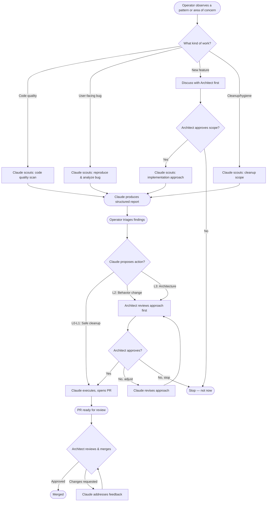

# Team Collaboration Flow — "Scout, Propose, Decide"

## Main Flow

## Escalation Levels Reference

| Level | Description | Who decides |
|-------|-------------|-------------|
| **L0** | Formatting, dead code, typos | Claude proceeds |
| **L1** | Safe refactor, extract function, rename | Claude proceeds, Operator reviews PR |
| **L2** | Behavior change, new util, pattern shift | Architect approves before work |
| **L3** | Architecture, new dependency, schema change | Architect approves before work |

## Scout Report Format

When Claude runs a `scout` command, the report should include:

1. **Area scanned** — what files/modules were analyzed
2. **Findings** — ranked by severity (critical → minor)
3. **Recommendations** — proposed actions with escalation level
4. **Risks** — what could go wrong if left unaddressed
