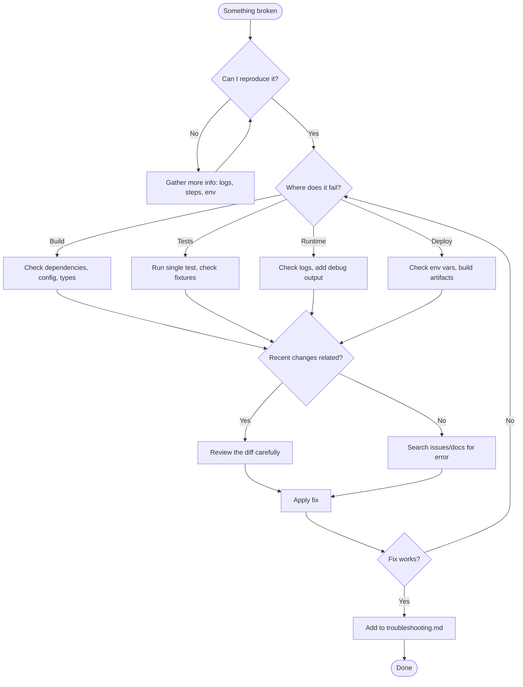
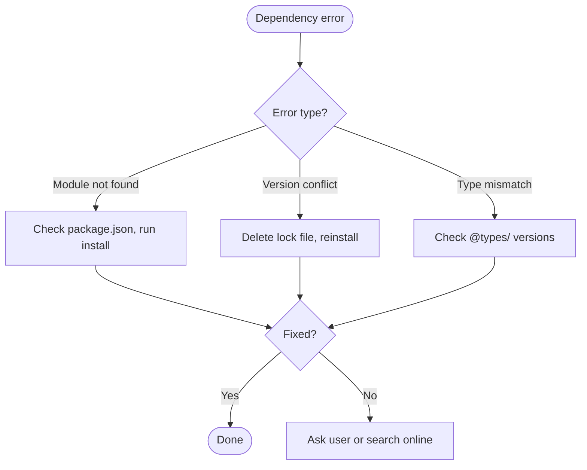
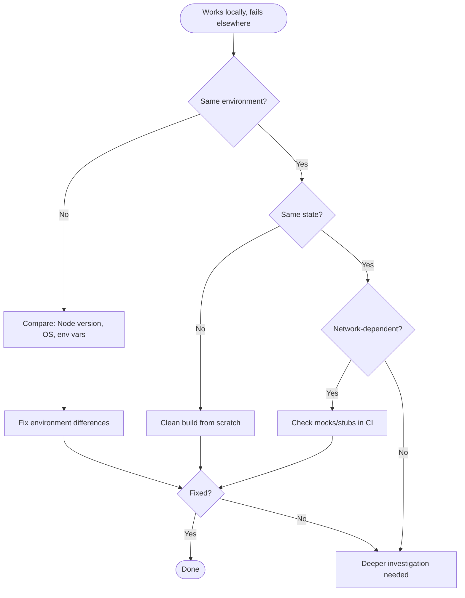

# Troubleshooting Decision Flow

## General Debug Flow

```mermaid
flowchart TD
    START([Something broken]) --> REPRO{Can I reproduce it?}
    REPRO -->|No| GATHER[Gather more info: logs, steps, env]
    REPRO -->|Yes| ISOLATE{Where does it fail?}

    GATHER --> REPRO

    ISOLATE -->|Build| BUILD[Check dependencies, config, types]
    ISOLATE -->|Tests| TESTS[Run single test, check fixtures]
    ISOLATE -->|Runtime| RUNTIME[Check logs, add debug output]
    ISOLATE -->|Deploy| DEPLOY[Check env vars, build artifacts]

    BUILD --> RECENT{Recent changes related?}
    TESTS --> RECENT
    RUNTIME --> RECENT
    DEPLOY --> RECENT

    RECENT -->|Yes| DIFF[Review the diff carefully]
    RECENT -->|No| SEARCH[Search issues/docs for error]

    DIFF --> FIX[Apply fix]
    SEARCH --> FIX

    FIX --> VERIFY{Fix works?}
    VERIFY -->|Yes| DOCUMENT[Add to troubleshooting.md]
    VERIFY -->|No| ISOLATE
    DOCUMENT --> DONE([Done])
```

## Dependency Issues

```mermaid
flowchart TD
    START([Dependency error]) --> TYPE{Error type?}
    TYPE -->|Module not found| INSTALL[Check package.json, run install]
    TYPE -->|Version conflict| LOCK[Delete lock file, reinstall]
    TYPE -->|Type mismatch| TYPES[Check @types/ versions]

    INSTALL --> VERIFY{Fixed?}
    LOCK --> VERIFY
    TYPES --> VERIFY

    VERIFY -->|Yes| DONE([Done])
    VERIFY -->|No| ESCALATE[Ask user or search online]
```

## "It Works Locally" Flow

```mermaid
flowchart TD
    START([Works locally, fails elsewhere]) --> ENV{Same environment?}
    ENV -->|No| DIFF[Compare: Node version, OS, env vars]
    ENV -->|Yes| STATE{Same state?}

    STATE -->|No| CLEAN[Clean build from scratch]
    STATE -->|Yes| NETWORK{Network-dependent?}

    DIFF --> FIX[Fix environment differences]
    CLEAN --> VERIFY{Fixed?}
    NETWORK -->|Yes| MOCK[Check mocks/stubs in CI]
    NETWORK -->|No| ESCALATE[Deeper investigation needed]

    FIX --> VERIFY
    MOCK --> VERIFY
    VERIFY -->|Yes| DONE([Done])
    VERIFY -->|No| ESCALATE
```
