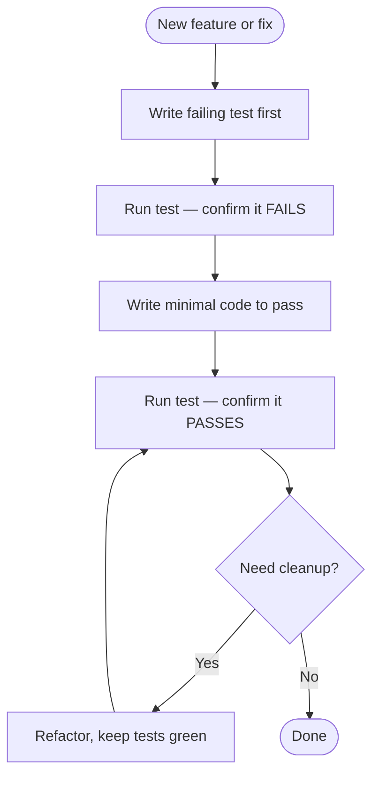

# Testing Guide

## Overview

<!-- TODO: Fill in testing strategy -->

## Test-Driven Development (TDD)

TDD is the default workflow for agentic development. Writing tests first gives the agent a clear pass/fail signal and prevents drift.

### TDD Workflow



### Why TDD Works for Agentic Development

- **Clear contract**: The test defines exactly what "done" looks like
- **Autonomous iteration**: The agent can run tests and self-correct without human input
- **Prevents over-engineering**: You only write code needed to pass the test
- **Built-in verification**: No separate "did it work?" step — the test answers that
- **Regression safety**: Every feature ships with its own guard rail

### TDD Rules

1. **Write the test first** — before any implementation code
2. **See it fail** — a test that has never failed proves nothing
3. **Minimal implementation** — write just enough code to make the test pass
4. **One behavior per test** — keep tests focused and readable
5. **Refactor under green** — only clean up when all tests pass

### When to Apply TDD

| Scenario | Apply TDD? |
|----------|-----------|
| New feature / tool / endpoint | Yes — always |
| Bug fix | Yes — write test that reproduces the bug first |
| Refactoring | Write characterization tests first if none exist |
| Exploratory / PoC | Optional — but write tests before declaring it "done" |
| Config / docs changes | No |

## Test Infrastructure

### Frameworks

<!-- TODO: Fill in -->

### Test Location

<!-- TODO: Fill in -->

## Running Tests

<!-- TODO: Fill in -->

```bash
# Example:
# npm test              # All tests
# npm run test:unit     # Unit tests
# npm run test:e2e      # End-to-end tests
```

## Test Patterns

<!-- TODO: Fill in examples of test patterns used in this project -->

## Best Practices

- Test behavior, not implementation details
- Use accessible queries over test IDs where possible
- Mock external dependencies at the boundary
- Each test should be independent and idempotent

## Verification Checklist

After running tests, verify:
- [ ] All tests passed
- [ ] No console errors or warnings in test output
- [ ] Coverage hasn't decreased
